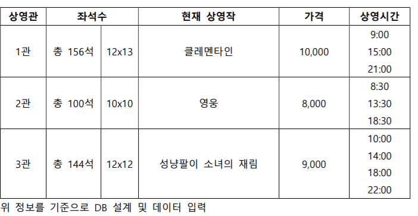
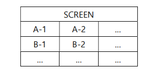

# 영화 예매 사이트 개발

### 극장 정보

## 구현해야하는 기능

### 1. 영화 예매
1. 상영관/상영작/상영시간 선택
  - 전체 좌석 및 남은 좌석 표기
2. 관람인원/좌석 선택
 - 좌상단을 기준으로 넘버링하여 좌석번호 지정

3. 애매 확인 및 예매
 - 상영관/상영작/상영시간/관람인원/선택좌석/총가격 표기하여 입력 정보 확인
 - 비회원 예매, 핸드폰 번호 입력 (필수)

### 2. 예매 내역 확인
- 예매 시 입력 받은 핸드폰 번호를 기준으로 예매 내역 조회
